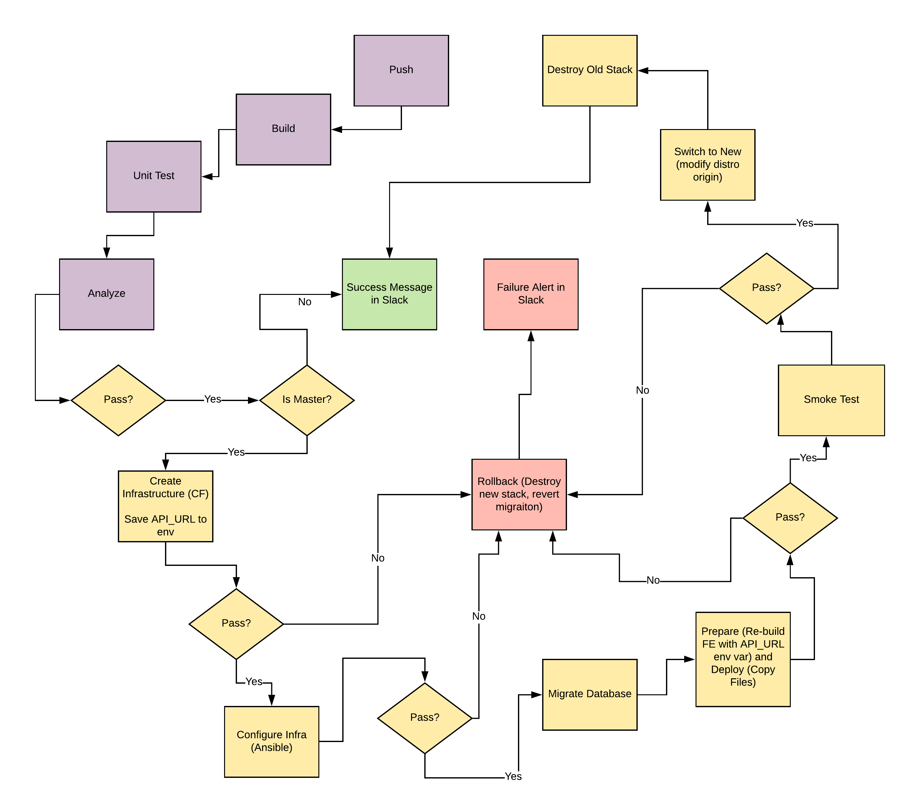

# UdaPeople: Give your Application Auto-Deploy Superpowers

This project helped me prove my mastery of the following learning objectives:

- Explain the fundamentals and benefits of CI/CD to achieve, build, and deploy automation for cloud-based software products.
- Utilize Deployment Strategies to design and build CI/CD pipelines that support Continuous Delivery processes.
- Utilize a configuration management tool to accomplish deployment to cloud-based servers.
- Surface critical server errors for diagnosis using centralized structured logging.

## Diagram of UdaPeople CI/CD Pipeline

This project built the following CI/CD pipeline:

## Instructions

- [Selling CI/CD](instructions/0-selling-cicd.md)
- [Getting Started](instructions/1-getting-started.md)
- [Deploying Working, Trustworthy Software](instructions/2-deploying-trustworthy-code.md)
- [Configuration Management](instructions/3-configuration-management.md)
- [Turn Errors into Sirens](instructions/4-turn-errors-into-sirens.md)

## Project Submission

For my submission, I submitted the following:

- A text file named `urls.txt` including:
  1. Public Url to GitHub repository (not private) **[URL01]**
  2. Public URL for my S3 Bucket (aka, my green candidate front-end) **[URL02]**
  3. Public URL for my CloudFront distribution (aka, my blue production front-end) **[URL03]**
  4. Public URLs to the deployed application back-end in EC2 **[URL04]**
  5. Public URL to my Prometheus Server **[URL05]**

- Screenshots in a PNG format, named using the screenshot number listed in the instructions.
  1. Job failed because of compilation errors. **[SCREENSHOT01]**
  2. Job failed because of unit tests. **[SCREENSHOT02]**
  3. Job that failed because of vulnerable packages. **[SCREENSHOT03]**
  4. An alert from one of my failed builds. **[SCREENSHOT04]**
  5. Appropriate job failure for infrastructure creation. **[SCREENSHOT05]**
  6. Appropriate job failure for the smoke test job. **[SCREENSHOT06]**
  7. Successful rollback after a failed smoke test. **[SCREENSHOT07]**  
  8. Successful promotion job. **[SCREENSHOT08]**
  9. Successful cleanup job. **[SCREENSHOT09]**
  10. Only deploy on pushed to `master` branch. **[SCREENSHOT10]**
  11. Provide a screenshot of a graph of my EC2 instance including available memory, available disk space, and CPU usage. **[SCREENSHOT11]**
  12. Provide a screenshot of an alert that was sent by Prometheus. **[SCREENSHOT12]**

- A presentation in PDF format named `presentation.pdf`.

## Built With

- [Circle CI](https://www.circleci.com) - Cloud-based CI/CD service
- [Amazon AWS](https://aws.amazon.com/) - Cloud services
- [AWS CLI](https://aws.amazon.com/cli/) - Command-line tool for AWS
- [CloudFormation](https://aws.amazon.com/cloudformation/) - Infrastructure as code
- [Ansible](https://www.ansible.com/) - Configuration management tool
- [Prometheus](https://prometheus.io/) - Monitoring tool

## License

[License](LICENSE.md)
